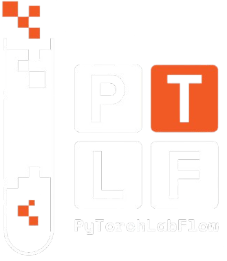
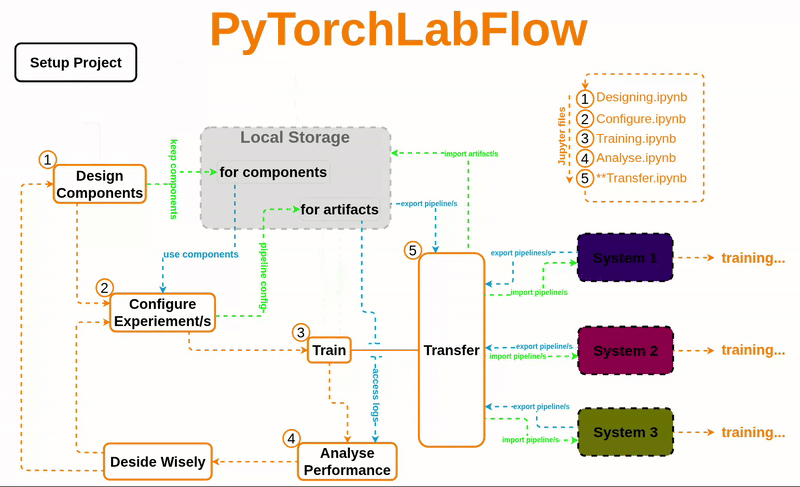

<div align="center">

  

  <!-- <h1>PyTorchLabFlow</h1> -->

  <strong>Streamline Your PyTorch Experiments. Offline-First, Secure, Reproducible and Portable.</strong>

</div>

<div align="center">

[](https://github.com/BBEK-Anand/PyTorchLabFlow/actions/workflows/tests.yml) 
[](https://pytorchlabflow.readthedocs.io/en/latest/?badge=latest) 
[](https://pypi.org/project/PyTorchLabFlow/)
[](https://pepy.tech/projects/pytorchlabflow)
[](./LICENSE)
[](https://github.com/BBEK-Anand/PyTorchLabFlow/stargazers)
[](https://github.com/BBEK-Anand/PyTorchLabFlow/network/members)

</div>

---

**PyTorchLabFlow** is a lightweight, offline-first framework designed to bring structure and sanity to your deep learning experiments. It automates project setup, manages configurations, and tracks results, all while keeping your data completely private and secure on your local machine.


### 🤔 The Problem: Experiment Chaos

If you've worked on any deep learning project, this probably sounds familiar:

* 📂 **Messy Directories**: A chaotic mix of notebooks, scripts, model weights, and config files with names like `model_final_v2_best.pth`.
* ❓ **Lost Configurations**: Forgetting which hyperparameters, dataset version, or code commit produced your best results.
* 📊 **Difficult Comparisons**: Struggling to isolate the impact of a single change (e.g., a different learning rate) when comparing dozens of similar experiment runs that share the same model or dataset.
* 💻 **Portability Nightmare**: Moving your project from a laptop to a powerful cloud server requires tedious and error-prone reconfiguration.
* 🔒 **Privacy Concerns**: Using online experiment trackers means sending potentially sensitive code and data to third-party servers.
* 🌐 **Internet Dependency**: Many popular tools require a constant internet connection, hindering productivity in offline environments.


## ✨ The Solution: PyTorchLabFlow

PyTorchLabFlow tackles this chaos with a simple, research-first philosophy.

* **Structure by Default**: It enforces a clean, standardized project structure, so you always know where to find your models, datasets, configs, and results.
* **Reproducibility Built-In**: Every experiment is automatically saved with its unique configuration, weights, and performance history, making any result perfectly reproducible.
* **Effortless Portability**: The `transfer` feature lets you package an entire experiment and move it to another machine with a single command. Go from local prototyping to large-scale training without friction.
* **100% Offline & Private**: Your work stays on your machine. Always. No data is ever sent to the cloud, ensuring complete privacy and security.

## 🚀 Quick Start

Get up and running in under 5 minutes.

### 1. Installation
```bash
pip install PyTorchLabFlow
```

### 2\. Workflow

Atypical Workflow where  you can  do  all  your  experiemnts/trails differ by  different Component and/or parameters is some fixed number of dedicated Jupiter files. No headech of finding trials that share  same  code-block( here it is Componet) and  analysing their performance,  just use  functions,  PipeLine manages all these  things ,  just focus  on analysis and dicision making. refer [Workflow in documentation](https://pytorchlabflow.readthedocs.io/en/latest/user_guide/workflow.html) for more details.




## 📚 Documentation & Resources

Dive deeper with our comprehensive resources.

  * 📖 **Official Documentation (Read the Docs)**: For complete API references, tutorials, and advanced guides.
      * ➡️ **[pytorchlabflow.readthedocs.io](https://pytorchlabflow.readthedocs.io/)**
  <!--* 🌐 **Project Homepage**: A polished presentation of the project, its features, and key concepts.
       * ➡️ **[bbek-anand.github.io/PyTorchLabFlow/](https://www.google.com/search?q=https://bbek-anand.github.io/PyTorchLabFlow/)** -->
  * ✍️ **Medium Articles (Deep Dive)**: Understand the "why" behind the framework.
      * ➡️ **[Why I Built PyTorchLabFlow](https://medium.com/@bbek-anand/why-i-built-pytorchlabflow-research-first-experiment-tracking-for-deep-learning-chaos-a50b5bc47dde)**
  * ✈️ **End-to-End Example Project**: See a complete, real-world application.
      * ➡️ **[Military Aircraft Classification Project](https://www.google.com/search?q=https://github.com/BBEK-Anand/Military_Air_Craft_Classification)**

## 🤝 Contributing

Contributions are the lifeblood of open source\! We welcome bug reports, feature requests, and pull requests. Whether you're a seasoned developer or just starting, your help is valued.

1.  **Fork** the repository.
2.  Create a new branch (`git checkout -b feature/your-feature-name`).
3.  Make your changes and **commit** them (`git commit -m 'Add some amazing feature'`).
4.  **Push** to the branch (`git push origin feature/your-feature-name`).
5.  Open a **Pull Request**.

Please read our `CONTRIBUTING.md` guide for more details on our code of conduct and the process for submitting pull requests.

## 📜 License

This project is licensed under the Apache License 2.0. See the [LICENSE](https://www.google.com/search?q=./LICENSE) file for details.

## 📄 How to Cite

If you use PyTorchLabFlow in your research, please consider citing it:

```bibtex
@misc{PyTorchLabFlow,
  author       = {BBEK-Anand},
  title        = {PyTorchLabFlow: A Python FrameWork for Managing Deep Learning Experiments in PyTorch},
  year         = {2024},
  url          = {[https://github.com/BBEK-Anand/PyTorchLabFlow](https://github.com/BBEK-Anand/PyTorchLabFlow)},
  note         = {Version 0.2.5},
}
```
