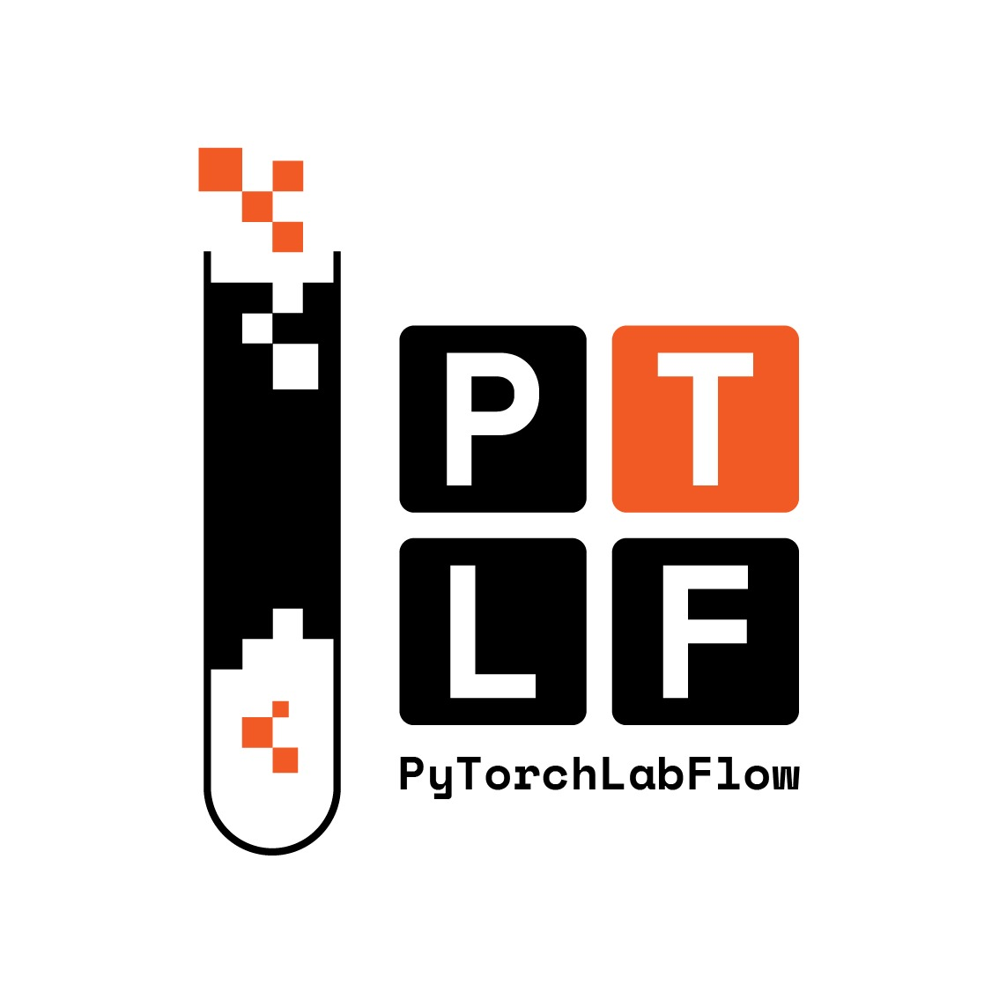

PyTorchLabFlow documentation
============================

PyTorchLabFlow is a modular deep learning framework designed for building flexible, reusable, and composable deep learning pipelines.

.. toctree::
   :maxdepth: 2
   :caption: Contents:

   user_guide/index
   api/api
   manual/index
   changelog/index